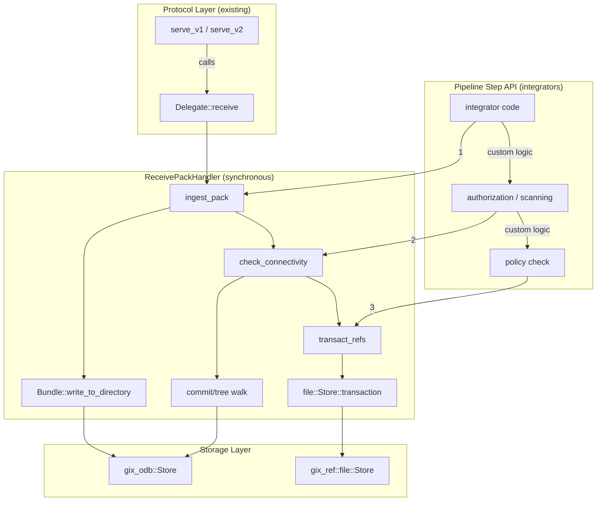
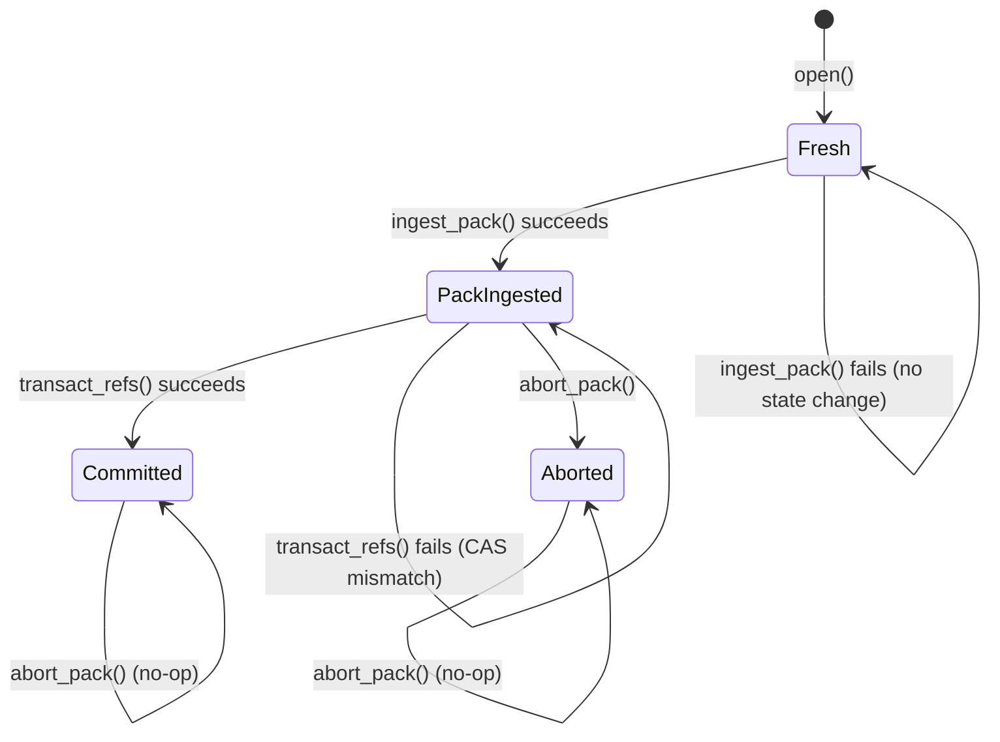

# Design Document: Async Receive-Pack Handler

## Overview

This document describes the technical design of `ReceivePackHandler`, a server-side handler that orchestrates the backend work for `git push` after the protocol framing layer has parsed the incoming request. The handler lives in the `gix-protocol` crate's `receive_pack` module (or a submodule thereof) and operates on bare repositories.

The handler implements three discrete pipeline stages — pack ingestion, connectivity checking, and atomic ref transaction — exposed both as individual public methods (Pipeline Step API) and as an all-in-one `Delegate` trait implementation. This dual interface lets simple servers call `serve_v1`/`serve_v2` directly while advanced integrators insert authorization, secrets scanning, or policy enforcement between steps.

Key design decisions:

1. **Synchronous library, async decided by caller**: The handler is purely synchronous. Pack ingestion, connectivity checking, and ref transactions all use blocking filesystem I/O and CPU-bound computation — there's nothing to `await`. The existing async protocol layer (`serve_v2` async variant) already bridges into blocking context via `BlockOn`, so the `Delegate::receive` call is already running in a blocking context. Integrators using the Pipeline Step API from an async runtime can wrap calls in `spawn_blocking` themselves — the handler doesn't impose any runtime choice.

2. **No thin-pack resolution in the handler**: Thin-pack resolution is delegated entirely to `gix_pack::Bundle::write_to_directory` via `LookupRefDeltaObjectsIter`. The handler only provides the ODB lookup closure.

3. **Stateful session**: `ReceivePackHandler` holds mutable state tracking which pipeline stages have completed, enabling error-on-misuse when stages are called out of order.

4. **Bare repository assumption**: The handler resolves all paths (object dir, ref store) relative to the repository root — there is no working tree.

## Architecture



The handler is constructed from a repository path, opening the ODB and ref store. Each push session creates one `ReceivePackHandler` instance. The lifecycle is:

1. **Construction** — open `gix_odb::Store` and `gix_ref::file::Store` at repository root
2. **Pack Ingestion** — write pack+index to objects dir, produce `.keep` file
3. **Connectivity Check** — walk from new ref tips, verify all objects reachable
4. **Ref Transaction** — CAS-update refs atomically, remove `.keep` on success
5. **Abort** (alternative) — remove `.keep` file, discarding the pack

## Components and Interfaces

### `ReceivePackHandler`

The main orchestrator struct. Holds repository state and tracks session progress.

```rust
/// Configuration for the receive-pack handler.
#[derive(Debug, Clone)]
pub struct Options {
    /// Thread limit for pack indexing. `None` = all available cores.
    pub thread_limit: Option<usize>,
    /// Hash algorithm for object ids.
    pub object_hash: gix_hash::Kind,
    /// Pack iteration integrity mode.
    pub iteration_mode: gix_pack::data::input::Mode,
}

impl Default for Options {
    fn default() -> Self {
        Options {
            thread_limit: None,
            object_hash: gix_hash::Kind::default(),
            iteration_mode: gix_pack::data::input::Mode::Verify,
        }
    }
}

/// Tracks which pipeline stages have been executed.
#[derive(Debug, Clone, Copy, PartialEq, Eq)]
enum SessionState {
    /// Handler is newly created, no stages executed.
    Fresh,
    /// Pack has been ingested successfully.
    PackIngested,
    /// Pack was aborted (`.keep` removed).
    Aborted,
    /// Refs have been transacted (terminal state).
    Committed,
}

/// The receive-pack handler for one push session.
pub struct ReceivePackHandler {
    /// Object database store.
    odb: gix_odb::Store,
    /// Reference store (file-based).
    ref_store: gix_ref::file::Store,
    /// Repository root path (bare repo).
    repo_path: PathBuf,
    /// Object directory path.
    objects_dir: PathBuf,
    /// Handler configuration.
    options: Options,
    /// Current session lifecycle state.
    state: SessionState,
    /// Outcome from pack ingestion, if completed.
    ingest_outcome: Option<gix_pack::bundle::write::Outcome>,
}
```

### `IngestOutcome`

Wraps the pack write result with additional context needed by subsequent stages.

```rust
/// Result of successful pack ingestion.
pub struct IngestOutcome {
    /// The underlying bundle write outcome (paths, index info).
    pub outcome: gix_pack::bundle::write::Outcome,
    /// Number of objects received.
    pub object_count: u32,
}
```

### `ConnectivityResult`

```rust
/// Result of a successful connectivity check.
pub struct ConnectivityResult {
    /// Object ids reachable from new ref targets that are not
    /// reachable from pre-existing refs (the "new" object set).
    pub new_objects: HashSet<gix_hash::ObjectId>,
}
```

### `TransactionResult`

```rust
/// Per-ref outcome from the atomic ref transaction.
pub struct RefUpdateResult {
    /// The ref name.
    pub ref_name: BString,
    /// Whether this particular ref was updated successfully.
    pub status: RefUpdateStatus,
}

pub enum RefUpdateStatus {
    /// Successfully updated/created/deleted.
    Ok,
    /// Rejected with a reason (CAS mismatch, etc).
    Rejected { reason: String },
}

/// Overall transaction outcome.
pub struct TransactionResult {
    /// Per-ref results in the same order as input updates.
    pub ref_results: Vec<RefUpdateResult>,
}
```

### Public API (Pipeline Steps)

```rust
impl ReceivePackHandler {
    /// Construct a handler for the bare repository at `repo_path`.
    pub fn open(repo_path: PathBuf, options: Options) -> Result<Self, OpenError>;

    /// Ingest pack data from the given byte reader.
    /// Writes pack + index to the object directory, resolving thin-pack deltas via ODB.
    pub fn ingest_pack(&mut self, pack_data: &mut dyn io::Read) -> Result<IngestOutcome, IngestError>;

    /// Verify connectivity of all new ref targets against the ODB.
    /// Requires a prior successful `ingest_pack` call.
    pub fn check_connectivity(
        &self,
        updates: &[super::Update],
    ) -> Result<ConnectivityResult, ConnectivityError>;

    /// Execute an atomic ref transaction for the given updates.
    /// Requires a prior successful `ingest_pack` call.
    /// Does NOT require `check_connectivity` — integrators may skip or replace it.
    pub fn transact_refs(
        &mut self,
        updates: &[super::Update],
    ) -> Result<TransactionResult, TransactError>;

    /// Abort the current session: remove the `.keep` file so the pack
    /// becomes eligible for GC. No-op if already committed or aborted.
    pub fn abort_pack(&mut self) -> Result<(), std::io::Error>;
}
```

### Delegate Implementation

```rust
impl super::Delegate for ReceivePackHandler {
    fn receive(
        &mut self,
        request: &super::Request,
        pack_data: &mut dyn io::Read,
    ) -> Result<super::Response, BoxError>;
}
```

The `Delegate::receive` implementation runs the full pipeline synchronously. Since it's called from within `serve_v1`/`serve_v2` (which already handle the blocking-to-async bridge via `BlockOn` in the async variant), no async machinery is needed here.

## Data Models

### Session State Machine



### Update Command Mapping to RefEdit

| Update field | Condition | RefEdit Change | PreviousValue |
|---|---|---|---|
| `old_id` ≠ zero, `new_id` ≠ zero | Normal update | `Change::Update { new: Target::Object(new_id) }` | `MustExistAndMatch(Target::Object(old_id))` |
| `old_id` = zero, `new_id` ≠ zero | Ref creation | `Change::Update { new: Target::Object(new_id) }` | `MustNotExist` |
| `old_id` ≠ zero, `new_id` = zero | Ref deletion | `Change::Delete {}` | `MustExistAndMatch(Target::Object(old_id))` |

### Pack Ingestion Data Flow

```
pack bytes (io::Read)
  → BufReader
    → BytesToEntriesIter (parse pack header + entries)
      → LookupRefDeltaObjectsIter (resolve thin-pack ref-deltas via ODB)
        → EntriesToBytesIter (rewrite as offset-deltas, write to tempfile)
          → index::write_data_iter_to_stream (build index in parallel)
            → persist tempfiles atomically (pack, idx, .keep)
```

### Connectivity Check Algorithm

```
Input: updates (list of Update), odb (with new pack loaded)
Output: set of new object ids OR error (missing object)

1. Collect pre-existing ref tips:
   tips = { oid | ref in ref_store.iter() }

2. For each update where new_id ≠ zero_id:
   a. Peel new_id to commit (if tag → peel recursively)
   b. Walk commit graph (BFS/DFS) from new_id:
      - For each commit:
        - If commit.id ∈ tips → stop this path (already known reachable)
        - Verify commit.tree_id exists in ODB
        - Walk tree recursively:
          - For each blob entry → verify exists in ODB
          - For each tree entry → verify exists, recurse
          - For each commit-mode entry (submodule) → skip
      - Add commit.id to visited set
   c. If any object missing → return error(missing_oid, expected_type, ref_name)

3. Return ConnectivityResult { new_objects: visited - tips }
```

## Correctness Properties

*A property is a characteristic or behavior that should hold true across all valid executions of a system — essentially, a formal statement about what the system should do. Properties serve as the bridge between human-readable specifications and machine-verifiable correctness guarantees.*

### Property 1: Update-to-RefEdit mapping preserves semantics

*For any* `Update` command, the mapping to `RefEdit` SHALL produce:
- `Change::Update` with `PreviousValue::MustExistAndMatch(Target::Object(old_id))` when both `old_id` and `new_id` are non-zero (normal update),
- `Change::Update` with `PreviousValue::MustNotExist` when `old_id` is zero (creation),
- `Change::Delete` with `PreviousValue::MustExistAndMatch(Target::Object(old_id))` when `new_id` is zero (deletion).

**Validates: Requirements 3.1, 3.2, 3.3**

### Property 2: Malformed pack produces error with no filesystem artifacts

*For any* byte sequence that does not constitute a valid pack (corrupt header, truncated data, bad checksum), calling `ingest_pack` SHALL return an error AND SHALL NOT leave any new `.pack`, `.idx`, or `.keep` files in the repository object directory.

**Validates: Requirements 1.6, 1.7**

### Property 3: Thin pack with resolvable bases ingests successfully

*For any* valid thin pack whose ref-delta base objects all exist in the repository ODB, `ingest_pack` SHALL succeed and produce an outcome where the written pack index accounts for all objects (original entries plus resolved bases).

**Validates: Requirements 1.2**

### Property 4: Non-empty pack ingestion produces complete file set

*For any* valid pack containing one or more objects, successful `ingest_pack` SHALL produce an outcome where `data_path`, `index_path`, and `keep_path` are all `Some`, and all referenced files exist on disk.

**Validates: Requirements 1.4**

### Property 5: Connectivity check succeeds on complete object graphs

*For any* set of ref updates where every commit, tree, and blob reachable from new ref targets exists in the ODB (including newly ingested objects), `check_connectivity` SHALL report success.

**Validates: Requirements 2.1, 2.4**

### Property 6: Connectivity walk terminates at pre-existing ref tips

*For any* object graph where new commits have ancestors reachable from pre-existing refs, the connectivity check SHALL stop traversal at those ancestors and SHALL NOT require objects below them to be present in the new pack.

**Validates: Requirements 2.2**

### Property 7: Deletion updates are excluded from connectivity checking

*For any* `Update` where `new_id` is the zero id, the connectivity checker SHALL skip that update entirely — it SHALL NOT attempt to resolve or walk from the zero id.

**Validates: Requirements 2.5**

### Property 8: Submodule tree entries do not trigger missing-object errors

*For any* tree containing entries with commit mode (gitlinks / submodules), the connectivity checker SHALL skip those entries without treating them as missing commits.

**Validates: Requirements 2.6**

### Property 9: Successful ref transaction removes the .keep file

*For any* push session where `ingest_pack` produced a `.keep` file and `transact_refs` succeeds, the `.keep` file SHALL no longer exist on disk after `transact_refs` returns.

**Validates: Requirements 3.7**

### Property 10: abort_pack removes the .keep file

*For any* push session where `ingest_pack` produced a `.keep` file and `abort_pack` is called, the `.keep` file SHALL no longer exist on disk after `abort_pack` returns.

**Validates: Requirements 4.4**

### Property 11: Ingested objects are accessible through ODB

*For any* valid pack successfully ingested via `ingest_pack`, every object contained in that pack SHALL be resolvable through the ODB for subsequent `check_connectivity` and `transact_refs` calls within the same session.

**Validates: Requirements 4.1, 4.5**

### Property 12: Pipeline failure yields Error status with all refs rejected

*For any* push where any pipeline stage (pack ingestion, connectivity check) fails, the `Delegate::receive` response SHALL have `UnpackStatus::Error` and SHALL mark every requested ref update as `RefStatus::Rejected`.

**Validates: Requirements 5.4, 5.5, 5.9**

### Property 13: Successful pipeline yields Ok status for all refs

*For any* push where all pipeline stages succeed, the `Delegate::receive` response SHALL have `UnpackStatus::Ok` and SHALL contain exactly one `RefStatus::Ok` entry per successfully updated ref, in the same order as the input updates.

**Validates: Requirements 5.3**

### Property 14: check_connectivity returns the correct new-object set

*For any* set of ref updates against a repository, `check_connectivity` SHALL return a set of object ids equal to the set of objects reachable from new ref targets minus the set of objects reachable from pre-existing ref tips.

**Validates: Requirements 4.2**


## Error Handling

The handler uses `gix-error` conventions (the `gix-protocol` crate already uses `thiserror`; follow whichever pattern is already established in the crate — check `Cargo.toml`). Errors are categorized by pipeline stage:

### Error Types

```rust
/// Errors that can occur during handler construction.
#[derive(Debug, thiserror::Error)]
pub enum OpenError {
    #[error("Failed to open object database at {path}")]
    Odb {
        path: PathBuf,
        #[source]
        source: Box<dyn std::error::Error + Send + Sync>,
    },
    #[error("Failed to open ref store at {path}")]
    RefStore {
        path: PathBuf,
        #[source]
        source: Box<dyn std::error::Error + Send + Sync>,
    },
    #[error("Repository path does not exist or is not a directory: {path}")]
    InvalidPath { path: PathBuf },
}

/// Errors from pack ingestion.
#[derive(Debug, thiserror::Error)]
pub enum IngestError {
    #[error("Pack data is malformed")]
    MalformedPack(#[source] gix_pack::bundle::write::Error),
    #[error("Missing ref-delta base object {oid}")]
    MissingBase { oid: gix_hash::ObjectId },
}

/// Errors from connectivity checking.
#[derive(Debug, thiserror::Error)]
pub enum ConnectivityError {
    #[error("Missing {expected_kind} object {oid} referenced from {ref_name}")]
    MissingObject {
        oid: gix_hash::ObjectId,
        expected_kind: gix_object::Kind,
        ref_name: BString,
    },
    #[error("Pack ingestion has not been performed")]
    NotIngested,
    #[error(transparent)]
    ObjectRead(#[from] gix_object::find::existing::Error),
}

/// Errors from ref transaction.
#[derive(Debug, thiserror::Error)]
pub enum TransactError {
    #[error("Pack ingestion has not been performed")]
    NotIngested,
    #[error("Ref transaction preparation failed")]
    Prepare(#[source] Box<dyn std::error::Error + Send + Sync>),
    #[error("Ref transaction commit failed")]
    Commit(#[source] Box<dyn std::error::Error + Send + Sync>),
    #[error("Failed to remove .keep file at {path}")]
    KeepFileRemoval {
        path: PathBuf,
        #[source]
        source: std::io::Error,
    },
}
```

### Error Propagation Strategy

1. **Pack ingestion failures** — The `Bundle::write_to_directory` error is wrapped in `IngestError::MalformedPack`. Temporary files are cleaned up automatically by `gix-tempfile` on drop.

2. **Connectivity failures** — The walk stops at the first missing object and returns `ConnectivityError::MissingObject` with full context (oid, expected type, triggering ref).

3. **Ref transaction failures** — CAS mismatches are surfaced as per-ref `RefUpdateStatus::Rejected` entries (not as a top-level error), allowing the caller to see which refs failed. Only infrastructure failures (I/O errors, lock contention) surface as `TransactError`.

4. **State violations** — Calling `check_connectivity` or `transact_refs` before `ingest_pack` returns `NotIngested` immediately, guiding the integrator to correct API usage.

5. **Delegate error mapping** — When running as a `Delegate`, all error types are mapped to the appropriate `Response`:
   - `IngestError` → `UnpackStatus::Error(message)`, all refs `Rejected`
   - `ConnectivityError` → `UnpackStatus::Error(message)`, all refs `Rejected`
   - `TransactError` → `UnpackStatus::Error(message)`, per-ref statuses from transaction

## Testing Strategy

### Unit Tests (example-based)

Unit tests verify specific scenarios and edge cases:

- **Handler construction**: valid bare repo → success; non-existent path → `OpenError`; path without `objects/` → `OpenError`
- **Empty pack ingestion**: zero-object pack → `IngestOutcome` with no paths
- **API misuse**: calling `check_connectivity` before `ingest_pack` → `NotIngested`
- **abort_pack idempotency**: abort after commit or double-abort → Ok
- **CAS mismatch**: push with wrong `old_id` → specific ref rejected
- **.keep removal failure**: simulate permission error → `TransactError::KeepFileRemoval`

### Property-Based Tests

Property tests verify universal correctness guarantees using `proptest` (already available in the gitoxide workspace). Each test runs a minimum of 100 iterations.

**Library**: `proptest`

**Configuration**: Each property test uses `proptest! { #[test] ... }` with at least 100 cases (default).

**Tag format**: Each test is annotated with a comment referencing its design property:
```rust
// Feature: async-receive-pack-handler, Property 1: Update-to-RefEdit mapping preserves semantics
```

**Property tests to implement:**

| Property | Generator Strategy | Assertion |
|---|---|---|
| 1: RefEdit mapping | Random `Update` with varied zero/non-zero id combinations | Produced `RefEdit` matches expected `Change` + `PreviousValue` |
| 2: Malformed pack → no artifacts | Random invalid byte sequences | Error returned, no new files in objects dir |
| 5: Connectivity on complete graphs | Random DAGs of commit/tree/blob objects | `check_connectivity` returns Ok |
| 7: Deletions excluded | Random updates with some `new_id = zero` | Those updates never trigger object lookup |
| 8: Submodule entries skipped | Trees with random gitlink entries | No missing-object error for gitlinks |
| 12: Pipeline failure → all rejected | Various failure modes | Response has Error + all refs Rejected |
| 13: Pipeline success → all Ok | Valid pushes with N refs | Response has Ok + N RefStatus::Ok |

### Integration Tests

Integration tests use real bare repositories created by fixture scripts:

- **Full push round-trip**: create bare repo, push a branch with commits/trees/blobs via the Delegate, verify refs are updated and objects accessible
- **Thin pack resolution**: create base objects in repo, push thin pack referencing them, verify successful ingestion
- **Concurrent push detection**: two handlers on same repo, one modifies a ref, second gets CAS mismatch
- **Connectivity walk termination**: repo with deep history, push adding one commit on top, verify walk terminates quickly (doesn't traverse entire history)
- **Pipeline step API**: integrator-style usage calling `ingest_pack` → custom check → `transact_refs` independently

### Test Fixtures

Following gitoxide conventions:
- Use `gix_testtools` for test scaffolding
- Create fixture scripts that produce bare repositories with known object graphs
- Use `_needs_archive` variants for cross-platform stability
- Use `.expect("reason")` or `?` in tests, never `.unwrap()`
