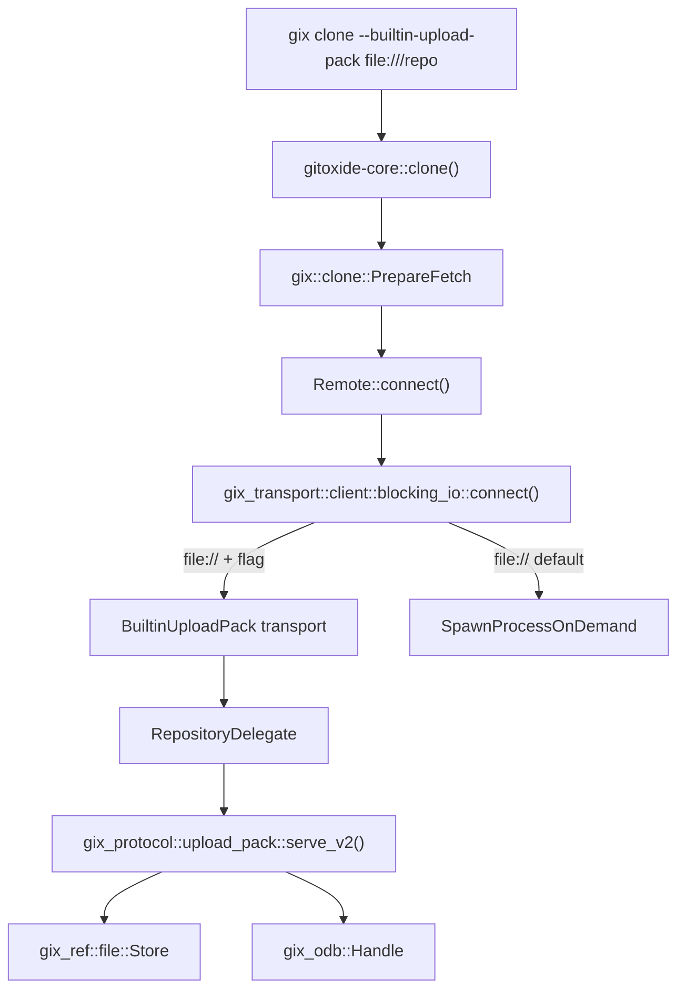

# Design Document: Experimental Upload-Pack Feature Gate

## Overview

This design introduces a compile-time feature gate (`experimental`) on the `gix` crate and a corresponding runtime CLI flag (`--builtin-upload-pack`) that routes `file://` clone/fetch operations through the in-process `gix-protocol::upload_pack` module instead of spawning an external `git-upload-pack` process.

The integration point is the transport layer's `connect()` function in `gix-transport/src/client/blocking_io/connect.rs`. When the runtime flag is active and the URL scheme is `file://`, the connector returns a new `BuiltinUploadPack` transport type that implements the `Transport` trait by driving `gix-protocol`'s `serve_v2()` through in-memory pipe pairs, backed by a `Delegate` implementation that opens the target repository via `gix-ref` and `gix-odb`.

### Design Decisions

1. **Feature lives on `gix` crate**: The `experimental` feature is defined on the `gix` crate (not `gix-transport`) because it requires pulling in `gix-protocol/blocking-server` plus `gix-odb` and `gix-ref` — dependencies that only make sense at the porcelain layer. The workspace `gitoxide` crate forwards it for CLI builds.

2. **Transport-level integration, not clone-level**: The built-in path is integrated at the transport `connect()` level so that *all* operations (clone, fetch, ls-remote) benefit automatically without per-command wiring.

3. **In-memory pipe pairs**: The `BuiltinUploadPack` transport uses `std::io::pipe()` (or a ring-buffer pair) to bridge the `Transport` trait's reader/writer model with `serve_v2()`'s `Read`/`Write` model, avoiding filesystem I/O for protocol framing.

4. **Delegate owns the repository handle**: A `RepositoryDelegate` struct holds a `gix_ref::file::Store` and an `gix_odb::Handle`, implementing `upload_pack::Delegate` to serve refs and generate packs.

## Architecture



### Data Flow (Built-In Path)

1. CLI parses `--builtin-upload-pack` flag, stores it in a thread-local or config override.
2. `gix::clone::PrepareFetch` creates the repository and calls `Remote::connect()`.
3. `connect()` reads the flag from transport options (via `configure()`) or an environment variable.
4. For `file://` + flag active: constructs `BuiltinUploadPack` with the repository path.
5. On `handshake()`: opens target repo's ref store and ODB, writes V2 capability advertisement into the response buffer, returns capabilities to the client protocol layer.
6. On `request()`: feeds the client's packetline request into `serve_v2()` via the delegate, streams response back through the `RequestWriter`'s read half.

## Components and Interfaces

### 1. Feature Flag Wiring

**`gix/Cargo.toml`** — new feature:
```toml
## Experimental features not yet stable. Enables built-in upload-pack for file:// transports.
experimental = ["gix-protocol/blocking-server", "dep:gix-transport"]
```

**`Cargo.toml` (workspace root)** — forwarding:
```toml
## Enable experimental features in gix for development builds.
experimental = ["gix/experimental"]
```

Added to `max` and `max-pure` feature sets but *not* `small`, `lean`, or `lean-async`.

### 2. Runtime Option Plumbing

**`src/plumbing/options/mod.rs`** — new flag on `clone::Platform` (and `fetch::Platform`):
```rust
/// Use the built-in in-process upload-pack instead of spawning git-upload-pack.
/// Requires the `experimental` feature to be compiled in.
#[clap(long, hide = !cfg!(feature = "experimental"))]
pub builtin_upload_pack: bool,
```

When the feature is not compiled in but the flag is passed, the CLI checks early and exits with an error message:
```
error: --builtin-upload-pack requires the `experimental` feature (build with `--features experimental`)
```

The flag is threaded through `gitoxide-core::repository::clone::Options` and ultimately passed as a transport configuration option.

### 3. Transport Configuration

A new configuration struct is defined to signal the built-in path:

```rust
// In gix-transport/src/client/mod.rs (or a new submodule)
/// Configuration requesting built-in upload-pack for file:// transports.
#[derive(Debug, Clone)]
pub struct BuiltinUploadPackOptions {
    /// Whether to use the in-process upload-pack implementation.
    pub enabled: bool,
}
```

This is passed via `TransportWithoutIO::configure()` on the connection before the handshake. The `connect()` function in `blocking_io/connect.rs` checks for this config when constructing the `file://` transport.

### 4. `BuiltinUploadPack` Transport

Located in `gix-transport/src/client/blocking_io/builtin_upload_pack.rs` (gated behind a new `blocking-server` feature on `gix-transport` that re-exports `gix-protocol/blocking-server`):

```rust
pub struct BuiltinUploadPack {
    /// Path to the target repository.
    path: BString,
    /// Protocol version negotiated.
    desired_version: Protocol,
    /// State after handshake.
    state: Option<HandshakeState>,
}

struct HandshakeState {
    ref_store: gix_ref::file::Store,
    odb: gix_odb::Handle,
    capabilities: Capabilities,
}
```

**However**, because `gix-transport` is a low-level crate that should not depend on `gix-odb`/`gix-ref`/`gix-protocol`, the actual `BuiltinUploadPack` transport implementation lives in the **`gix` crate** itself (gated behind `experimental`), and is injected into the transport layer via the `configure_connection` callback on `PrepareFetch`:

```rust
// gix/src/clone/fetch/mod.rs (or a new gix/src/transport/builtin_upload_pack.rs)
#[cfg(feature = "experimental")]
pub(crate) mod builtin_upload_pack;
```

The implementation:
- Implements `TransportWithoutIO` + `Transport` from `gix-transport`.
- On `handshake()`: opens the repo at `path`, builds capabilities, returns V2 `SetServiceResponse`.
- On `request()`: creates a pipe pair, spawns `serve_v2()` on the write end, returns a `RequestWriter` backed by the read end.

### 5. `RepositoryDelegate`

```rust
#[cfg(feature = "experimental")]
struct RepositoryDelegate {
    ref_store: gix_ref::file::Store,
    odb: gix_odb::Handle,
    object_hash: gix_hash::Kind,
}

impl upload_pack::Delegate for RepositoryDelegate {
    fn ls_refs(&mut self, request: &LsRefs) -> Result<Vec<Ref>, BoxError> {
        // Iterate packed + loose refs, apply prefix filters from request,
        // resolve symref targets and peeled OIDs.
    }

    fn fetch(&mut self, request: &Fetch) -> Result<FetchOutput, BoxError> {
        let negotiation = negotiate_fetch_with_repository(
            request,
            &self.ref_store,
            |oid| self.odb.contains(oid),
        )?;
        negotiation.into_output_with_repository_pack(
            request,
            self.odb.clone(),
            self.object_hash,
        ).map_err(|e| Box::new(e) as BoxError)
    }
}
```

### 6. Integration in `connect()`

The `connect()` function in `gix/src/remote/connect.rs` (or via `configure_connection`) checks the options:

```rust
// Pseudocode in the connection setup path:
if url.scheme == Scheme::File && options.builtin_upload_pack {
    #[cfg(feature = "experimental")]
    {
        return Ok(Box::new(BuiltinUploadPack::new(url.path, version, trace)));
    }
    #[cfg(not(feature = "experimental"))]
    {
        return Err(Error::ExperimentalFeatureNotCompiled);
    }
}
```

## Data Models

### Transport Option

```rust
/// Signals that clone/fetch should use the in-process upload-pack.
pub struct BuiltinUploadPackConfig {
    pub enabled: bool,
}
```

Passed via the existing `TransportWithoutIO::configure(&dyn Any)` mechanism, which `SpawnProcessOnDemand` already accepts (it currently no-ops).

### Delegate State

```rust
struct RepositoryDelegate {
    ref_store: gix_ref::file::Store,
    odb: gix_odb::Handle,
    object_hash: gix_hash::Kind,
}
```

No new persistent data models are introduced. The delegate is ephemeral, created per-connection.

## Correctness Properties

*A property is a characteristic or behavior that should hold true across all valid executions of a system — essentially, a formal statement about what the system should do. Properties serve as the bridge between human-readable specifications and machine-verifiable correctness guarantees.*

### Property 1: Built-in / external equivalence

*For any* valid git repository containing at least one ref, cloning via the built-in upload-pack path SHALL produce the same set of refs (names and OIDs) and the same reachable object set as cloning via the external `git-upload-pack` process.

**Validates: Requirements 2.6, 3.2**

### Property 2: Non-file scheme passthrough

*For any* URL whose scheme is not `file://` (e.g., `git://`, `ssh://`, `https://`), the `--builtin-upload-pack` flag SHALL have no effect on transport selection — the standard transport for that scheme is used unchanged.

**Validates: Requirements 2.4**

### Property 3: Error messages include context

*For any* invalid repository path or unresolvable ref name passed to the built-in upload-pack transport, the returned error SHALL contain the failing path or ref name as a substring.

**Validates: Requirements 3.3**

### Property 4: Incremental fetch produces minimal pack

*For any* repository state and any non-empty set of objects already known to the client, a fetch via the built-in upload-pack SHALL produce a pack containing only objects reachable from the requested tips that are not reachable from the client's `have` set.

**Validates: Requirements 3.4**

## Error Handling

| Scenario | Behavior |
|----------|----------|
| `--builtin-upload-pack` passed without `experimental` compiled | CLI exits with code 2, stderr: `error: --builtin-upload-pack requires the 'experimental' feature` |
| Target path does not exist or is not a git repository | Transport returns `Err` with path in message; clone aborts with anyhow context |
| Ref requested via `want-ref` does not exist | `negotiate_fetch_with_repository` populates `unresolved_want_refs`; response omits it; client-side fetch logic reports missing refs |
| ODB corruption (object referenced but missing) | `FetchPackGenerationError::MissingObject` propagated; clone aborts |
| Pack exceeds u32::MAX objects | `FetchPackGenerationError::TooManyObjects` propagated; clone aborts |

All errors flow through the existing `anyhow` error chain in the CLI, preserving context for the user.

## Testing Strategy

### Unit Tests (example-based)

- **Feature compilation**: `cargo build --no-default-features` must succeed without any built-in upload-pack symbols; `cargo build --features experimental` must include them.
- **CLI flag visibility**: With `experimental`, `gix clone --help` includes `--builtin-upload-pack`; without, it does not.
- **Flag without feature**: Passing `--builtin-upload-pack` to a non-experimental build produces the expected error message on stderr.
- **Default behavior unchanged**: Cloning a file:// URL without the flag uses `SpawnProcessOnDemand` (verifiable via trace output).

### Property-Based Tests

Property-based testing applies here because the core correctness claim is an equivalence property over an unbounded input space (arbitrary repository states). The `proptest` crate (already a dev-dependency in `gix-protocol`) will be used.

- Minimum 100 iterations per property test.
- Tag format: **Feature: experimental-upload-pack-feature-gate, Property {N}: {text}**

**Property tests target the `RepositoryDelegate` and `negotiate_fetch_with_repository` logic:**

1. **Equivalence** (Property 1): Generate random DAGs of commits/trees/blobs, write to a temp repo, clone via both paths, compare ref maps and object sets.
2. **Non-file passthrough** (Property 2): Generate random non-file URL schemes, verify transport selection is unaffected.
3. **Error context** (Property 3): Generate random invalid paths and ref names, verify error messages.
4. **Incremental correctness** (Property 4): Generate commit DAGs, select random "have" subsets, fetch, verify pack contains exactly the complement.

### Journey Tests

A new section in `tests/journey/gix.sh`:

```bash
(when "cloning with the built-in upload-pack"
  snapshot="$snapshot/builtin-upload-pack"

  (with "a repository that has branches and tags"
    # Setup: create a fixture repo with main branch + v1.0 tag
    (it "succeeds with the --builtin-upload-pack flag" && {
      expect_run $SUCCESSFULLY gix clone --builtin-upload-pack "file://$fixture_repo" "$dest"
    })
    (it "produces a valid HEAD" && {
      expect_run $SUCCESSFULLY git -C "$dest" rev-parse HEAD
    })
    (it "has the same refs as a standard clone" && {
      expect_run $SUCCESSFULLY git -C "$dest_standard" for-each-ref --format='%(refname) %(objectname)'
      expect_run $SUCCESSFULLY git -C "$dest" for-each-ref --format='%(refname) %(objectname)'
      # Compare outputs
    })
  )
)
```

Guarded by `[[ "$kind" == max* ]]` to only run when the experimental feature is compiled in.
