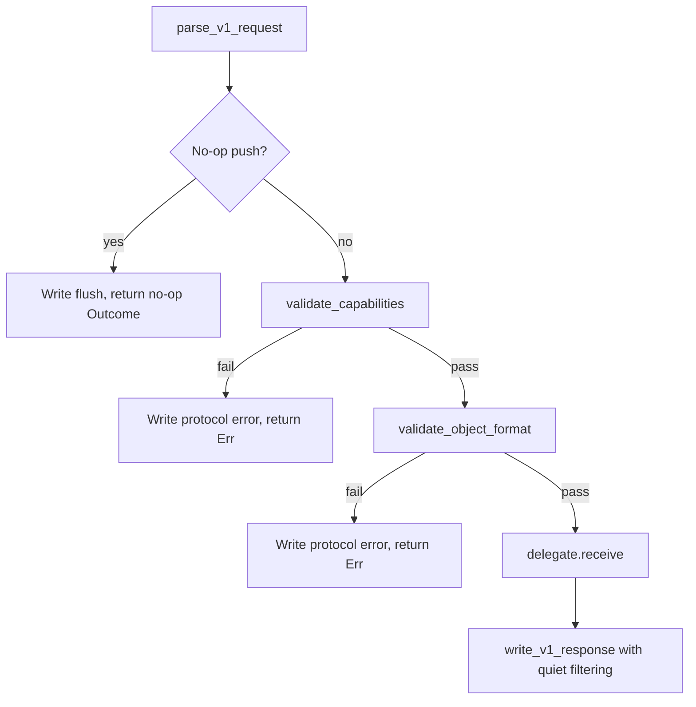

# Design Document: Receive-Pack V1 Capability Validation & Enforcement

## Overview

This document describes the protocol-layer validation and enforcement added on top of the existing `gix-protocol::receive_pack` module. The existing code already provides:

- `parse_v1_request` / `parse_v2_request` — parse incoming push requests
- `serve_v1` / `serve_v2` — end-to-end request serving with delegate invocation
- `write_v1_response` / `write_v1_ref_advertisement` — response formatting
- `ReceivePackHandler` with pack ingestion, connectivity checking, and ref transactions (via Pipeline Step API and `Delegate` trait)

What is **missing** and what this spec adds:

1. A canonical `ServerCapabilitySet` definition and validation gate that rejects unknown client capabilities before delegate invocation
2. Early `object-format` mismatch detection at the protocol layer
3. Atomic vs per-ref failure mode selection in `transact_refs` based on negotiated capabilities
4. `no-thin` enforcement by conditionally disabling ODB lookup during pack ingestion
5. `quiet` capability suppression in the response writer
6. Delete-only push detection that skips pack ingestion and connectivity
7. Capability-aware response writing that respects the negotiated feature set

All additions live in the `gix-protocol` crate within the existing `receive_pack` module (and its `handler` submodule). No new crates are introduced.

## Architecture

```
┌─────────────────────────────────────────────────────────────────────┐
│                         serve_v1 (updated)                          │
├─────────────────────────────────────────────────────────────────────┤
│  1. parse_v1_request()              (existing, unchanged)           │
│  2. validate_capabilities()         ◄── NEW: reject unknown caps    │
│  3. validate_object_format()        ◄── NEW: early hash check       │
│  4. detect empty/no-op push         (existing)                      │
│  5. delegate.receive(request, pack) (existing)                      │
│  6. write_v1_response()             ◄── UPDATED: quiet suppression  │
└─────────────────────────────────────────────────────────────────────┘

┌─────────────────────────────────────────────────────────────────────┐
│                    ReceivePackHandler (updated)                      │
├─────────────────────────────────────────────────────────────────────┤
│  Delegate::receive():                                               │
│    A. Check if delete-only push → skip pack + connectivity          │
│    B. ingest_pack() with thin_pack_lookup = None when no-thin       │
│    C. check_connectivity() (skip for delete-only)                   │
│    D. transact_refs() with mode = Atomic | PerRef                   │
└─────────────────────────────────────────────────────────────────────┘
```

### Validation Flow (new `serve_v1` sequence)



## Components and Interfaces

### `ServerCapabilitySet`

A compile-time constant defining the capabilities the server advertises and is willing to honor.

```rust
/// Capabilities the server supports for receive-pack V1.
///
/// The `agent` capability is always implicitly accepted from clients but
/// is listed here because it appears in the advertisement.
pub const SERVER_CAPABILITIES: &[&str] = &[
    "report-status",
    "report-status-v2",
    "side-band-64k",
    "delete-refs",
    "push-options",
    "atomic",
    "quiet",
    "no-thin",
    "object-format",
    "agent",
];
```

### `ServerConfig` (new struct for receive-pack)

Mirrors the pattern already used in `upload_pack::ServerConfig`:

```rust
/// Server-side configuration for receive-pack capability and protocol validation.
#[derive(Debug, Clone, Copy, PartialEq, Eq)]
pub struct ServerConfig {
    /// The object hash algorithm this server uses.
    pub object_hash: gix_hash::Kind,
}

impl Default for ServerConfig {
    fn default() -> Self {
        Self {
            object_hash: gix_hash::Kind::Sha1,
        }
    }
}
```

### `validate_capabilities` Function

```rust
/// Validate client capabilities against the server's supported set.
///
/// Returns `Ok(())` if all client capabilities are recognized.
/// Returns an error identifying the first unsupported capability.
///
/// The `agent` capability is always accepted regardless of value.
/// `report-status-v2` requires `side-band-64k` to also be present.
fn validate_capabilities(capabilities: &[Capability]) -> Result<(), Error> { ... }
```

**Logic:**
1. For each capability in the request:
   - If `name == "agent"` → skip (always accepted)
   - If `name` is not in `SERVER_CAPABILITIES` → return `Error::UnsupportedCapability { name }`
2. If `report-status-v2` is present but `side-band-64k` is not → return `Error::ReportStatusV2RequiresSideband`
3. Return `Ok(())`

### `validate_object_format` Function

```rust
/// Validate the client's object-format capability against the server config.
///
/// If the client sends `object-format=<algo>`, it must match `config.object_hash`.
/// If absent, `sha1` is assumed as the default.
fn validate_object_format(
    capabilities: &[Capability],
    config: &ServerConfig,
) -> Result<(), Error> { ... }
```

**Logic:**
1. Find the `object-format` capability in the list
2. If absent: assume `sha1`, compare against `config.object_hash`
3. If present: parse the value, verify it's a known algorithm name, compare against `config.object_hash`
4. On mismatch: return `Error::UnsupportedObjectFormat { requested, supported }`

This function reuses the same `KNOWN_OBJECT_FORMATS` pattern from `upload_pack`.

### Updated `serve_v1` Signature

```rust
/// Serve one protocol V1 receive-pack push request with capability validation.
///
/// The `config` parameter controls object-format validation.
/// Client capabilities are validated against `SERVER_CAPABILITIES` before
/// invoking the delegate.
pub fn serve_v1(
    input: impl io::Read,
    mut output: impl io::Write,
    delegate: &mut impl Delegate,
    config: &ServerConfig,
) -> Result<Outcome, Error> { ... }
```

The new `config` parameter is added. The existing `serve_v1` tests will need updating to pass `&ServerConfig::default()`.

### Updated `write_v1_response` — Quiet Suppression

```rust
/// Write a receive-pack response matching `request` capabilities.
///
/// When `quiet` is negotiated, sideband progress messages (channel 2) are
/// suppressed. Error messages (channel 3) are always transmitted.
pub fn write_v1_response(
    mut output: impl io::Write,
    request: &Request,
    response: &Response,
) -> Result<u64, Error> { ... }
```

The existing function signature is unchanged. The implementation adds a filter:

```rust
for message in &response.sideband_messages {
    if request.has_capability("quiet") && message.kind == SidebandMessageKind::Progress {
        continue; // suppress progress in quiet mode
    }
    // ... write message as before
}
```

### Updated `write_v1_ref_advertisement`

The function already accepts a `capabilities` slice. The caller is responsible for constructing it from `SERVER_CAPABILITIES` with the correct `object-format` value and `agent` value. No signature change needed — but we add a helper:

```rust
/// Build the capability list for a V1 ref advertisement.
///
/// Includes all `SERVER_CAPABILITIES` with appropriate values:
/// - `object-format=<hash_name>` from `config.object_hash`
/// - `agent=gix/<version>` with the crate version
pub fn server_capability_advertisement(
    config: &ServerConfig,
) -> Vec<(&'static str, Option<String>)> { ... }
```

### Updated `ReceivePackHandler` — No-Thin Enforcement

The handler's `ingest_pack` already passes `Some(odb_handle)` as the `thin_pack_base_object_lookup` parameter to `Bundle::write_to_directory`. To enforce `no-thin`:

```rust
/// Configuration controlling per-session behavior derived from negotiated capabilities.
#[derive(Debug, Clone, Copy)]
pub struct SessionConfig {
    /// If true, reject thin packs (pass `None` for ODB lookup during ingestion).
    pub no_thin: bool,
    /// If true, use atomic transaction mode (all-or-nothing).
    pub atomic: bool,
}

impl Default for SessionConfig {
    fn default() -> Self {
        Self {
            no_thin: false,
            atomic: false,
        }
    }
}
```

The `ingest_pack` method is updated:

```rust
pub fn ingest_pack(
    &mut self,
    pack_data: &mut dyn io::Read,
    session_config: &SessionConfig,
) -> Result<IngestOutcome, IngestError> {
    // ...
    let thin_pack_lookup: Option<gix_odb::store::Handle<Arc<gix_odb::Store>>> = if session_config.no_thin {
        None // no ODB lookup → ref-deltas with missing bases will fail
    } else {
        Some(self.odb.to_handle_arc())
    };

    let outcome = gix_pack::Bundle::write_to_directory(
        &mut buffered,
        Some(&pack_dir),
        &mut gix_features::progress::Discard,
        &AtomicBool::new(false),
        thin_pack_lookup,
        // ...
    )?;
    // ...
}
```

### Updated `ReceivePackHandler` — Atomic vs Per-Ref Mode

The `transact_refs` method gains atomic/per-ref awareness:

```rust
pub fn transact_refs(
    &mut self,
    updates: &[super::Update],
    session_config: &SessionConfig,
) -> Result<TransactionResult, TransactError> {
    if session_config.atomic {
        self.transact_refs_atomic(updates)
    } else {
        self.transact_refs_per_ref(updates)
    }
}
```

**Atomic mode** (`transact_refs_atomic`):
- Collects all `RefEdit`s
- Executes as a single `ref_store.transaction()` prepare + commit
- If prepare fails (CAS mismatch on any ref): returns all refs as `Rejected` with atomic failure message
- If commit fails: returns all refs as `Rejected`
- On success: removes `.keep`, returns all `Ok`

**Per-ref mode** (`transact_refs_per_ref`):
- For each update independently:
  - Executes a single-ref transaction (prepare + commit)
  - Records `Ok` or `Rejected` per ref
  - A failure on one ref does not prevent processing the next
- After all refs processed: removes `.keep` if at least one succeeded
- Returns mixed results

### Updated `Delegate::receive` — Delete-Only Detection

```rust
fn receive(
    &mut self,
    request: &super::Request,
    pack_data: &mut dyn io::Read,
) -> Result<super::Response, BoxError> {
    let session_config = SessionConfig::from_request(request);
    let is_delete_only = request.updates.iter().all(|u| u.new_id.is_null());

    if is_delete_only {
        // Skip pack ingestion and connectivity check entirely.
        // Transition state directly for ref transaction.
        self.state = SessionState::PackIngested; // allow transact_refs
        match self.transact_refs(&request.updates, &session_config) {
            // ... map results to Response
        }
    } else {
        // Normal flow: ingest → connectivity → transact
        if let Err(e) = self.ingest_pack(pack_data, &session_config) { ... }
        if let Err(e) = self.check_connectivity(&request.updates) { ... }
        match self.transact_refs(&request.updates, &session_config) { ... }
    }
}
```

### `SessionConfig::from_request` Helper

```rust
impl SessionConfig {
    /// Derive session configuration from negotiated client capabilities.
    pub fn from_request(request: &super::Request) -> Self {
        Self {
            no_thin: request.has_capability("no-thin"),
            atomic: request.has_capability("atomic"),
        }
    }
}
```

### New Error Variants

Added to the existing `Error` enum:

```rust
#[derive(Debug, thiserror::Error)]
pub enum Error {
    // ... existing variants ...

    /// Client sent an unsupported capability.
    #[error("Unsupported capability {name:?} — not in server capability set")]
    UnsupportedCapability { name: BString },

    /// Client sent `report-status-v2` without `side-band-64k`.
    #[error("report-status-v2 requires side-band-64k transport")]
    ReportStatusV2RequiresSideband,

    /// Client's object-format value is not a recognized hash algorithm.
    #[error("Invalid object-format value {value:?}")]
    InvalidObjectFormat { value: BString },

    /// Client's object-format does not match the server's configured hash.
    #[error("Object-format mismatch: client requested {requested:?}, server supports {supported:?}")]
    UnsupportedObjectFormat { requested: BString, supported: BString },
}
```

## Data Models

### Capability Validation Decision Table

| Client sends | Server set contains? | `agent`? | Result |
|---|---|---|---|
| `report-status` | yes | no | Accept |
| `atomic` | yes | no | Accept |
| `agent=git/2.44` | yes | yes | Accept (any value) |
| `ofs-delta` | no | no | **Reject** |
| `thin-pack` | no | no | **Reject** |
| `report-status-v2` (no sideband) | yes | no | **Reject** (requires sideband) |
| `report-status-v2` + `side-band-64k` | yes | no | Accept |

### Object-Format Validation Decision Table

| Client `object-format` | Server `object_hash` | Result |
|---|---|---|
| absent | `Sha1` | Accept (default = sha1) |
| absent | `Sha256` | **Reject** (default sha1 ≠ sha256) |
| `sha1` | `Sha1` | Accept |
| `sha1` | `Sha256` | **Reject** |
| `sha256` | `Sha256` | Accept |
| `sha256` | `Sha1` | **Reject** |
| `blake3` (unknown) | any | **Reject** (invalid format) |

### Delete-Only Push Detection

```
is_delete_only = request.updates.iter().all(|u| u.new_id.is_null())
```

When `is_delete_only`:
- No pack data expected from client
- Skip `ingest_pack` entirely
- Skip `check_connectivity` entirely
- Proceed directly to `transact_refs` for deletion edits

### Response Format Decision Matrix

| `report-status` | `side-band-64k` | `quiet` | Output |
|---|---|---|---|
| yes | yes | no | Sideband: progress + errors + data(report-status) + flush |
| yes | yes | yes | Sideband: errors + data(report-status) + flush |
| yes | no | no | Plain: report-status lines + flush |
| yes | no | yes | Plain: report-status lines + flush (quiet only affects sideband) |
| no | yes | no | Flush only |
| no | no | no | Flush only |

## Error Handling

### Validation Error Propagation

Capability and object-format validation errors are returned as `Error` variants from `serve_v1`. They surface **before** the delegate is invoked, preventing any pack processing:

1. `validate_capabilities` failure → `Error::UnsupportedCapability` or `Error::ReportStatusV2RequiresSideband`
2. `validate_object_format` failure → `Error::InvalidObjectFormat` or `Error::UnsupportedObjectFormat`

The caller (`serve_v1`) returns these errors immediately. The transport layer (or the integrator calling `serve_v1`) is responsible for converting them to an appropriate protocol-level error response to the client.

### Handler Error Mapping with Atomic Mode

In atomic mode, when any ref fails during transaction preparation:

- The `gix_ref::file::Store::transaction().prepare()` call fails with the ref store's error
- The handler maps this to `TransactionResult` with all refs `Rejected` and the atomic failure reason
- This differs from per-ref mode where we catch per-ref CAS failures independently

### No-Thin Enforcement Errors

When `no-thin` is active and the pack contains ref-delta entries whose bases are missing:

- `Bundle::write_to_directory` is called with `thin_pack_base_object_lookup = None`
- The `BytesToEntriesIter` encounters a ref-delta with no way to resolve it
- This produces a `gix_pack::bundle::write::Error` (malformed pack / unresolvable delta)
- The handler wraps it as `IngestError::MalformedPack`
- The `Delegate::receive` impl maps it to `UnpackStatus::Error("thin packs not permitted")` with all refs rejected

## Correctness Properties

*A property is a characteristic or behavior that should hold true across all valid executions of a system — essentially, a formal statement about what the system should do. Properties serve as the bridge between human-readable specifications and machine-verifiable correctness guarantees.*

### Property 1: Ref advertisement includes all server capabilities with correct values

*For any* list of `AdvertisedRef` entries and any `ServerConfig`, calling `write_v1_ref_advertisement` with `server_capability_advertisement(config)` SHALL produce output where the first ref line's NUL-separated capability string contains every capability from `SERVER_CAPABILITIES`, the `object-format` value matches `config.object_hash.to_string()`, and the `agent` value starts with `gix/`.

**Validates: Requirements 1.2, 1.3, 1.4**

### Property 2: Capability validation rejects unknown capabilities and accepts valid ones

*For any* capability name that is not in `SERVER_CAPABILITIES` and is not `"agent"`, `validate_capabilities` SHALL return an error identifying that name. *For any* subset of capabilities drawn from `SERVER_CAPABILITIES` (satisfying dependency constraints), validation SHALL succeed.

**Validates: Requirements 2.2, 2.3, 2.6**

### Property 3: Object-format validation rejects mismatches and prevents delegate invocation

*For any* pair of (client hash algorithm, server hash algorithm) where the two differ, `validate_object_format` SHALL return an error. When the error occurs during `serve_v1`, the delegate SHALL NOT be invoked and no pack data SHALL be consumed.

**Validates: Requirements 3.1, 3.2, 3.4**

### Property 4: Atomic mode — all-or-nothing ref transaction semantics

*For any* set of ref updates executed in atomic mode, the transaction result SHALL either report all refs as `Ok` (when all CAS checks pass) or all refs as `Rejected` (when any CAS check fails). No mixed results are possible in atomic mode.

**Validates: Requirements 4.1, 4.2**

### Property 5: Per-ref mode — independent ref reporting

*For any* set of ref updates executed in per-ref mode, each ref SHALL be reported independently. A CAS failure on ref A SHALL NOT cause ref B to be reported as `Rejected` if ref B's CAS check passes.

**Validates: Requirements 4.3, 4.4, 4.5**

### Property 6: No-thin enforcement rejects thin packs

*For any* pack containing ref-delta entries whose base objects are not in the pack itself, when the `no-thin` capability is active, `ingest_pack` SHALL return an error. When `no-thin` is not active and the bases exist in the ODB, ingestion SHALL succeed.

**Validates: Requirements 5.1, 5.2, 5.3**

### Property 7: Quiet suppresses progress but preserves errors

*For any* `Response` containing sideband messages of both `Progress` and `Error` kinds, when the `quiet` capability is present in the request, the written output SHALL contain zero progress messages (channel 2) and SHALL contain all error messages (channel 3) unchanged.

**Validates: Requirements 6.1, 6.2, 6.3**

### Property 8: Delete-only pushes skip pack ingestion and connectivity

*For any* request where every update has `new_id == zero_id`, the handler SHALL NOT call `ingest_pack`, SHALL NOT call `check_connectivity`, and SHALL proceed directly to `transact_refs` producing per-ref status results for each deletion.

**Validates: Requirements 7.1, 7.2, 7.3**

### Property 9: Response format matches negotiated capabilities

*For any* `Request`/`Response` pair, the output of `write_v1_response` SHALL:
- Include report-status lines if and only if `report-status` or `report-status-v2` is negotiated
- Wrap report-status in sideband data frames if and only if `side-band-64k` is negotiated
- Produce only a flush packet when neither `report-status` nor `report-status-v2` is negotiated

**Validates: Requirements 9.1, 9.2, 9.3, 9.4**

## Testing Strategy

### Unit Tests (example-based)

- **ServerConfig defaults**: Verify `ServerConfig::default()` has `object_hash = Sha1`
- **Capability set completeness**: Assert `SERVER_CAPABILITIES` contains all 10 expected names
- **report-status-v2 without sideband**: Verify specific error returned
- **Object-format absent + sha256 server**: Verify rejection (default sha1 ≠ sha256)
- **Object-format=blake3**: Verify invalid format error
- **No-op push (empty flush)**: Verify flush response, zero-count Outcome, no delegate call
- **Delete-only with mixed refs**: Verify correct detection boundary (one non-deletion → not delete-only)
- **Atomic mode CAS failure**: Verify all refs rejected with atomic failure message
- **Agent with arbitrary value**: Verify `agent=anything/here` passes validation

### Property-Based Tests

**Library**: `proptest` (already in dev-dependencies)
**Minimum iterations**: 100 per property

| Property | Generator Strategy | Assertion |
|---|---|---|
| 1: Advertisement completeness | Random `Vec<AdvertisedRef>` (0–50 refs), random `ServerConfig` | Parse output, verify all capabilities present with correct values |
| 2: Capability validation | Random capability names (mix of valid/invalid/agent) | Valid subsets pass, invalid names rejected with correct error |
| 3: Object-format validation | Random (client_algo, server_algo) pairs from known formats | Matching pairs pass, mismatches rejected, delegate not called |
| 4: Atomic all-or-nothing | Random update sets (2–10 refs), inject CAS failure on 1 | All refs reported same status (all Ok or all Rejected) |
| 5: Per-ref independence | Random update sets (2–10 refs), inject CAS failure on subset | Failed refs = Rejected, passing refs = Ok, independent |
| 6: No-thin enforcement | Generate thin-pack-like data with missing bases | With no-thin: error; without no-thin + bases in ODB: success |
| 7: Quiet suppression | Random `Response` with N progress + M error messages | With quiet: 0 progress in output, M errors present; without quiet: N + M present |
| 8: Delete-only detection | Random update sets with all/some/no deletions | All-delete → no pack ingestion; mixed → normal flow |
| 9: Response format | Random capabilities × random Response | Output structure matches decision matrix |

### Integration Tests

- **Full push with capability validation**: Send push with valid capabilities through `serve_v1` with `ServerConfig`, verify end-to-end success
- **Push with unknown capability**: Send push with `ofs-delta`, verify error before delegate invocation
- **Sha256 mismatch**: Send `object-format=sha256` to sha1 server, verify early rejection
- **Atomic push with CAS race**: Two concurrent pushes to same ref, verify atomic semantics
- **No-thin with actual thin pack**: Create fixture with thin pack, verify rejection
- **Quiet mode sideband filtering**: Push with progress messages + quiet, verify only errors in output
- **Delete-only round-trip**: Push only deletions, verify refs removed without pack data

### Test Fixtures

Following gitoxide conventions:
- Use `gix_testtools` for test scaffolding
- Use `proptest` for property-based tests (already in workspace)
- Use `tempfile` for temporary bare repos in handler tests
- Use `.expect("reason")` or `?` in tests, never `.unwrap()`
