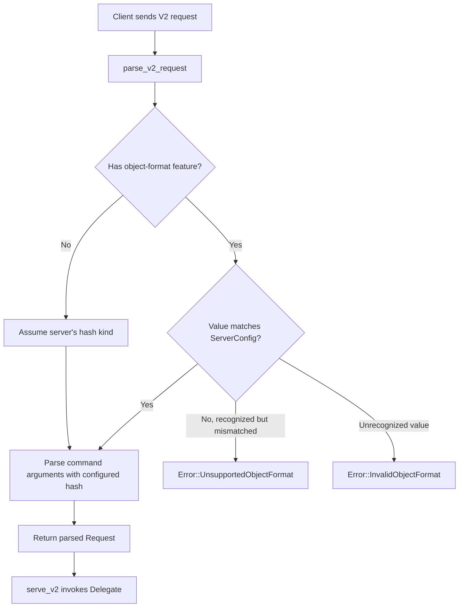
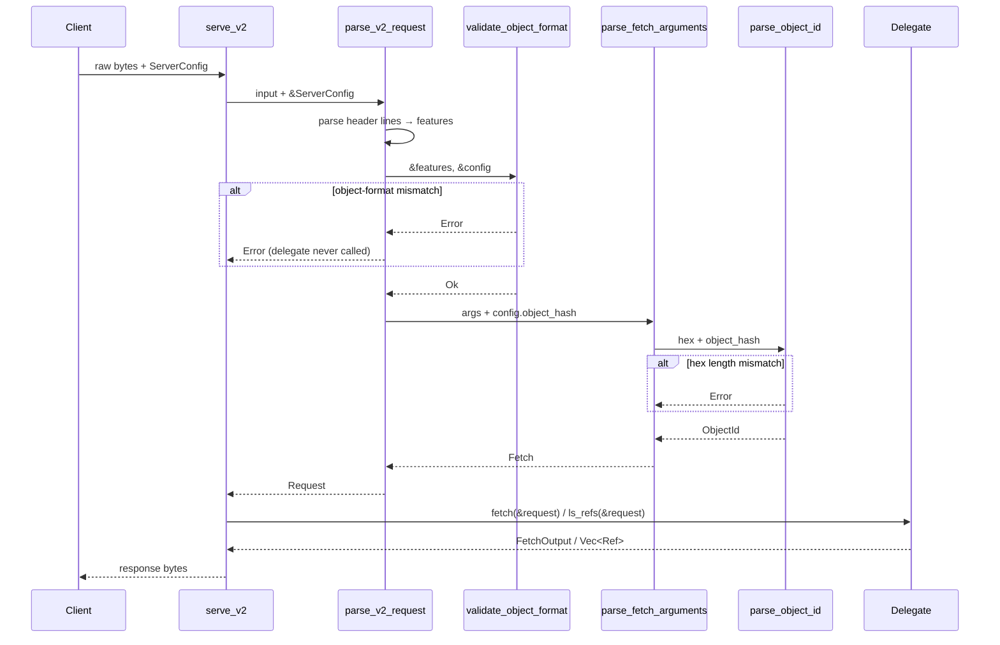

# Design Document: Upload-Pack Capability Validation

## Overview

This feature adds server-side capability validation to the `upload_pack` module in `gix-protocol`. The core problem: a client can currently declare `object-format=sha256` against a SHA-1 server and the server silently produces incorrect results. The fix introduces a minimal `ServerConfig` struct carrying the server's `gix_hash::Kind`, validates the client's `object-format` feature against it at parse time, and enforces correct OID hex lengths throughout fetch argument parsing.

The design prioritizes:
- **Early rejection** — validation happens in `parse_v2_request`, not deeper in serving logic
- **Minimal API surface** — `ServerConfig` is a single-field `Copy` struct
- **Backward compatibility** — `ServerConfig::default()` preserves current SHA-1 behavior
- **Async parity** — the async bridge functions pass config through unchanged

## Architecture

The validation integrates into the existing upload-pack request/response pipeline at the parsing layer:



### Module Structure

No new modules are introduced. All changes live in the existing files:

- `gix-protocol/src/upload_pack.rs` — `ServerConfig` struct, updated `parse_v2_request` and `serve_v2` signatures, new `Error` variants, updated `parse_object_id`
- `gix-protocol/src/upload_pack/async_io.rs` — updated `serve_v2` and `parse_v2_request` signatures to accept `&ServerConfig`, pass-through to blocking implementations via `BlockOn`

## Components and Interfaces

### ServerConfig

```rust
/// Server-side configuration for upload-pack capability validation.
#[derive(Debug, Clone, Copy, PartialEq, Eq)]
pub struct ServerConfig {
    /// The object hash algorithm this server supports.
    pub object_hash: gix_hash::Kind,
}

impl Default for ServerConfig {
    fn default() -> Self {
        Self {
            object_hash: gix_hash::Kind::Sha1,
        }
    }
}
```

**Rationale:** A single-field struct rather than passing `Kind` directly because:
1. It's forward-compatible — future server capabilities (e.g., allowed features, transfer limits) can be added without signature changes.
2. `Copy` keeps it zero-cost to pass by value or reference.
3. `Default` preserves backward-compatible SHA-1 behavior.

**Note on feature gates:** `gix_hash::Kind::Sha1` requires the `sha1` feature on `gix-hash`. Since `gix-protocol` already depends on `gix-hash` with `sha1` enabled (via the `sha1` feature flag), this is always available in practice. If a hypothetical sha256-only build were needed, the `Default` impl would need to be gated or use `Kind::shortest()`.

### Updated Function Signatures

#### `parse_v2_request`

```rust
#[cfg(any(feature = "blocking-server", feature = "async-server"))]
pub fn parse_v2_request(input: impl io::Read, config: &ServerConfig) -> Result<Request, Error> { ... }
```

This function gains a `config: &ServerConfig` parameter. After parsing header lines and extracting features, it:
1. Scans features for `object-format`
2. If found, validates the value against `config.object_hash`
3. Passes `config.object_hash` to `parse_fetch_arguments` for OID length validation

#### `serve_v2`

```rust
#[cfg(any(feature = "blocking-server", feature = "async-server"))]
pub fn serve_v2(
    input: impl io::Read,
    output: impl io::Write,
    delegate: &mut impl Delegate,
    config: &ServerConfig,
) -> Result<Outcome, Error> { ... }
```

The config is passed through to `parse_v2_request`. The delegate is only invoked after successful parsing (which includes validation).

#### Async variants

```rust
// async_io.rs
pub async fn serve_v2<R, W, D>(
    input: &mut R, output: &mut W, delegate: &mut D, config: &super::ServerConfig,
) -> Result<super::Outcome, super::Error>
where ...

pub async fn parse_v2_request<R>(
    input: &mut R, config: &super::ServerConfig,
) -> Result<super::Request, super::Error>
where ...
```

These pass `config` through to the blocking `super::` functions via `BlockOn`, unchanged in pattern from the existing bridge.

### Updated Error Enum

Two new variants are added to the existing `Error` enum:

```rust
#[derive(Debug, thiserror::Error)]
pub enum Error {
    // ... existing variants unchanged ...

    #[error("Client requested object-format \"{requested}\" but server supports \"{supported}\"")]
    UnsupportedObjectFormat {
        requested: BString,
        supported: BString,
    },

    #[error("Invalid object-format value \"{value}\" (expected \"sha1\" or \"sha256\")")]
    InvalidObjectFormat {
        value: BString,
    },

    #[error("Object ID hex length {actual} does not match expected {expected} for {hash_kind}")]
    ObjectIdLengthMismatch {
        actual: usize,
        expected: usize,
        hash_kind: gix_hash::Kind,
    },
}
```

**Rationale:**
- `UnsupportedObjectFormat` — client sent a recognized but mismatched hash (e.g., sha256 against a sha1 server). Includes both values for diagnostics.
- `InvalidObjectFormat` — client sent an unrecognized value (neither sha1 nor sha256).
- `ObjectIdLengthMismatch` — an OID in fetch arguments has the wrong hex length for the configured hash. This is separate from the existing `InvalidObjectId` (which covers non-hex characters) for clear diagnostics.

### Updated `parse_object_id`

```rust
#[cfg(any(feature = "blocking-server", feature = "async-server"))]
fn parse_object_id(
    line: &BStr,
    prefix: &[u8],
    command: &'static str,
    object_hash: gix_hash::Kind,
) -> Result<gix_hash::ObjectId, Error> {
    let hex = line
        .as_bytes()
        .strip_prefix(prefix)
        .ok_or_else(|| Error::MalformedArgument {
            command,
            line: line.to_owned(),
        })?;

    let expected_len = object_hash.len_in_hex();
    if hex.len() != expected_len {
        return Err(Error::ObjectIdLengthMismatch {
            actual: hex.len(),
            expected: expected_len,
            hash_kind: object_hash,
        });
    }

    gix_hash::ObjectId::from_hex(hex).map_err(|source| Error::InvalidObjectId {
        line: line.to_owned(),
        source,
    })
}
```

**Rationale:** `gix_hash::ObjectId::from_hex` auto-detects length and accepts any valid hex that fits a known hash size. But the server needs to *enforce* that the client sends OIDs matching the negotiated hash — a 40-char hex ID against a SHA-256 server should be rejected, not silently accepted as SHA-1. The explicit length check before `from_hex` provides this enforcement.

### Updated `parse_fetch_arguments`

```rust
fn parse_fetch_arguments(
    arguments: Vec<BString>,
    object_hash: gix_hash::Kind,
) -> Result<Fetch, Error> { ... }
```

The function gains an `object_hash` parameter and passes it to every `parse_object_id` call (for `want`, `have`, and `shallow` lines). `parse_ls_refs_arguments` remains unchanged since `ls-refs` doesn't contain OIDs.

### Feature Validation Logic

Integrated into `parse_v2_request` after header parsing:

```rust
/// Known `object-format` values — recognized regardless of compile-time hash features.
/// This ensures a sha256 request against a sha1-only build reports "unsupported" not "invalid".
const KNOWN_OBJECT_FORMATS: &[&str] = &["sha1", "sha256"];

fn validate_object_format(features: &[Feature], config: &ServerConfig) -> Result<(), Error> {
    for feature in features {
        if feature.name == "object-format" {
            let value = feature.value.as_deref().unwrap_or(b"".as_bstr());
            let value_str = match value.to_str() {
                Ok(s) => s,
                Err(_) => return Err(Error::InvalidObjectFormat { value: value.to_owned() }),
            };
            // Check if the value is a recognized hash name (independent of compile-time features)
            if !KNOWN_OBJECT_FORMATS.contains(&value_str) {
                return Err(Error::InvalidObjectFormat { value: value.to_owned() });
            }
            // Check if it matches the server's configured hash
            if value_str == config.object_hash.to_string().as_str() {
                return Ok(());
            }
            return Err(Error::UnsupportedObjectFormat {
                requested: value.to_owned(),
                supported: config.object_hash.to_string().into(),
            });
        }
    }
    // No object-format feature: assume server's hash — OK
    Ok(())
}
```

**Important:** The validation does NOT use `gix_hash::Kind::from_str()` because that function is gated on compile-time features — in a sha1-only build, `from_str("sha256")` returns `Err`, which would incorrectly classify a valid-but-unsupported request as "invalid" rather than "unsupported". Instead, we match against a hardcoded list of known format names and compare the string representation directly.

**Edge cases:**
- `object-format` without a `=value` → empty string → `InvalidObjectFormat` (correct per protocol V2 which requires a value)
- Multiple `object-format` features → first one wins, subsequent ignored (matches git behavior)
- Non-UTF-8 value → `InvalidObjectFormat` (can't be a valid hash name)

## Data Models

### Unchanged Types

The following types remain structurally unchanged (per Requirement 9.3):
- `Request` — still holds `features: Vec<Feature>` and `command: Command`
- `Feature` — still holds `name: BString` and `value: Option<BString>`
- `Command`, `LsRefs`, `Fetch`, `Outcome` — unchanged

### Data Flow



## Correctness Properties

*A property is a characteristic or behavior that should hold true across all valid executions of a system — essentially, a formal statement about what the system should do. Properties serve as the bridge between human-readable specifications and machine-verifiable correctness guarantees.*

### Property 1: Object-format validation accepts matching, rejects mismatched or invalid

*For any* `gix_hash::Kind` configured on the server, and *for any* string value in the `object-format` feature line:
- If the value is the string representation of the configured kind, parsing SHALL succeed.
- If the value is a recognized hash name that does not match the configured kind, parsing SHALL return `Error::UnsupportedObjectFormat`.
- If the value is not a recognized hash name, parsing SHALL return `Error::InvalidObjectFormat`.

**Validates: Requirements 2.1, 2.3, 3.1**

### Property 2: OID length enforcement

*For any* `gix_hash::Kind` configured on the server, and *for any* hex string in a `want`, `have`, or `shallow` argument line, `parse_object_id` SHALL succeed if and only if the hex string length equals `kind.len_in_hex()` AND the string contains only valid hex characters. If the length does not match, the parser SHALL return `Error::ObjectIdLengthMismatch`.

**Validates: Requirements 4.1, 4.2, 7.4**

### Property 3: Non-object-format features pass through without rejection

*For any* feature with a name that is not `"object-format"`, and *for any* value (including `None`), `parse_v2_request` SHALL include that feature in the returned `Request.features` list without returning an error.

**Validates: Requirements 5.1, 5.2, 5.3**

## Error Handling

| Error Variant | Trigger | Severity | Recovery |
|---|---|---|---|
| `UnsupportedObjectFormat` | Client sends recognized but mismatched `object-format` | Fatal for request | Client must retry with correct format or omit the feature |
| `InvalidObjectFormat` | Client sends unrecognized `object-format` value | Fatal for request | Client must send a valid hash name |
| `ObjectIdLengthMismatch` | OID hex length doesn't match configured hash | Fatal for request | Client must send correctly-sized OIDs |
| `InvalidObjectId` (existing) | OID contains non-hex characters | Fatal for request | Client must send valid hex |

All validation errors are returned from `parse_v2_request`, meaning the delegate is never invoked for invalid requests. This ensures no repository state is accessed before the request is fully validated.

The error types use `thiserror` consistent with the existing `Error` enum in this crate.

## Performance Notes

### Async `write_fetch_response` — reuse sideband packet buffer

The existing async `write_fetch_response` allocates a new `Vec` per sideband chunk in the pack streaming loop:

```rust
// Current (allocates per iteration):
loop {
    let mut packet_buf = Vec::new();
    encode::band_to_write(Channel::Data, &buffer[..bytes_read], &mut packet_buf)?;
    output.write_all(&packet_buf).await?;
}
```

For large pack transfers this is one heap allocation per ~65 KB chunk. The buffer should be hoisted out of the loop and reused via `clear()`:

```rust
// Improved (single allocation, reused):
let mut packet_buf = Vec::with_capacity(super::MAX_SIDEBAND_DATA_BYTES + 10);
loop {
    let bytes_read = pack_data.read(&mut buffer).await?;
    if bytes_read == 0 { break; }
    pack_bytes_sent += bytes_read as u64;
    packet_buf.clear();
    encode::band_to_write(Channel::Data, &buffer[..bytes_read], &mut packet_buf)?;
    output.write_all(&packet_buf).await?;
}
```

This is a pre-existing issue (not introduced by capability validation) but should be fixed alongside since both changes touch `async_io.rs`.

### Capability validation overhead — negligible

- Feature scan: O(n) over 1–3 features, byte comparison only, no allocations on the happy path.
- OID length check: single `usize` comparison per `parse_object_id` call — effectively free.
- `ServerConfig` is `Copy` (1 byte) — zero-cost to pass by reference or value.
- `to_str()` on the `object-format` value checks UTF-8 validity on 4–6 bytes — negligible.
- All `BString` allocations (`to_owned()`, `to_string().into()`) occur exclusively on error paths.

## Testing Strategy

### Property-Based Tests

Property-based testing is appropriate for this feature because the validation logic is pure — it takes structured input (features, hex strings) and produces deterministic accept/reject decisions. The input spaces (hash kind combinations, arbitrary strings, varying hex lengths) benefit from randomized exploration.

**Library:** `proptest` (already available in the gitoxide ecosystem via dev-dependencies in sibling crates)

**Configuration:** Minimum 100 iterations per property test.

**Tag format:** `Feature: upload-pack-capability-validation, Property N: <text>`

Each correctness property maps to a single property-based test:

1. **Property 1 test** — Generate random `Kind` values and random feature value strings. Assert the validation function's result matches the expected classification (accept/reject-unsupported/reject-invalid).

2. **Property 2 test** — Generate random `Kind` values and random hex strings of varying lengths (0..128 chars). Assert `parse_object_id` succeeds iff length == `kind.len_in_hex()` and all chars are hex.

3. **Property 3 test** — Generate random feature names (excluding "object-format") and random optional values. Assert parsing succeeds and the feature appears in the result.

### Unit Tests (Example-Based)

- `ServerConfig::default()` returns SHA-1 (Req 1.2)
- `serve_v2` with mismatched config never calls delegate (Req 6.3)
- Error display strings contain both formats (Req 3.1, 3.2)
- Absent `object-format` feature with SHA-256 config parses OIDs at 64-char length (Req 2.4)
- Capability advertisement helper produces correct `object-format=sha1` / `object-format=sha256` entries (Req 8.1, 8.2)
- Existing tests continue to pass with `ServerConfig::default()` (Req 9.1, 9.3)

### Integration Considerations

- The async bridge tests should verify that `serve_v2` and `parse_v2_request` in `async_io` correctly propagate validation errors (same as blocking).
- Existing tests in the crate that call `parse_v2_request` or `serve_v2` will need updating to pass `&ServerConfig::default()` — this serves as a compile-time verification of Req 9.3 (types unchanged) and a runtime verification of backward compatibility.
